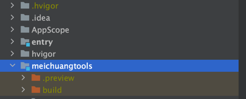

# meichuangtools

## 简介

meichuangtools《莓创工具库》，一套为开发者准备的基于 `ArkTs（9）语言` 开发的HarmonyOs多功能工具库。我们包含了各种类型的基础组件与图表组件。例如：`签名版`
、`折线图`、`柱状图`、`饼图`、`雷达图`等等。后续会上更多系列的工具。

## 官方文档地址

大家可以访问官方文档地址，查看更多详细的使用案例以及相应的参数配置。(即将推出)


## 安装教程
`由于组件库上传OHPM官网审核一直不通过，所以我们使用另外一种思路提供给大家使用`
1. 第一步：打开github地址下载源码
```shell
https://gitee.com/cyaofeng_admin/meichuangtools?_from=gitee_search
```
2. 第二步将下载的组件源码放在项目跟目录下
3. 
3. 第三步安装组件，执行以下代码即可。
```shell
 ohpm install ./meichuangtools/build/default/outputs/default/meichuangtools.har
```

# 使用案例

## 折线图

### 导入

```javascript
 import { McLineChart } from 'meichuangtools'
```

### 使用

```ArkTs
@Entry
@Component
struct Index {
  build() {
    Row() {
      McLineChart({
        options: {
          xAxis:{
            data:['周一','周二','周三','周四','周五','周六','周日']
          },
          yAxis:{
            name:'温度'
          },
          series:[
            {
              name:'最高气温',
              data:[11, 11, 15, 13, 12, 130, 10]
            },
            {
              name:'最低气温',
              data:[1, -20, 2, 5, 3, 2, 0]
            }
          ]
        }
      })
    }
    .height('50%')
  }
}
```

### `options` 基础参数介绍

| 参数名 | 类型  | 必填  | 说明                                          |
| ----  | ----  |-----|---------------------------------------------|
| xAxis | xAxis | 非必填 | 绘画直角坐标系 grid 中的 Y 轴。支持设置刻度、文本标签等功能以及样式。     |
| yAxis | yAxis | 非必填 | 绘画直角坐标系 grid 中的 Y 轴。支持设置刻度、文本标签、分割线等功能以及样式。 |
| series | series | 必填  | 用折线将各个数据点标志连接起来的图表，用于展现数据的变化趋势。             |


### `xAxis` 属性参数介绍
| 参数名       | 类型        | 必填  | 说明            |
|-----------|-----------|-----|---------------|
| axisLine  | axisLine  | 非必填 | 坐标轴轴线相关设置。    |
| axisTick  | axisTick  | 非必填 | 坐标轴刻度相关设置。    |
| axisLabel | axisLabel | 非必填 | 坐标轴刻度标签的相关设置。 |
| data      | array     | 必填  | 坐标轴的类目数据。     |


### `yAxis` 属性参数介绍
| 参数名           | 类型            | 必填  | 说明                             |
|---------------|---------------|-----|--------------------------------|
| name          | string        | 非必填 | 坐标轴名称。                     |
| nameTextStyle | nameTextStyle | 非必填 | 坐标轴名称的文字样式。                     |
| axisLine      | axisLine      | 非必填 | 坐标轴轴线相关设置。                     |
| axisTick      | axisTick      | 非必填 | 坐标轴刻度相关设置。                     |
| axisLabel     | axisLabel     | 非必填  | 坐标轴刻度标签的相关设置。 |

### `series` 属性参数介绍
| 参数名       | 类型        | 必填    | 说明                  |
|-----------|-----------|-------|---------------------|
| name      | string    | 必填    | 系列名称，用于tooltip的显示，legend 的图例筛选，在 setOption<br/> 更新数据和配置项时用于指定对应的系列。          |
| lineStyle | lineStyle | 非必填   | 坐标轴名称的文字样式。          |
| axisLine  | axisLine  | 非必填   | 线条样式。               |
| label     | label     | 非必填   | 图形上的文本标签，可用于说明图形的一些数据信息，比如值，名称等。       |
| itemStyle | itemStyle | 非必填   | 折线拐点标志的样式。 |
| data      | array     | 必填    | 系列中的数据内容数组。数组项通常为具体的数据项。 |


### `axisLine` 公共属性参数介绍
| 参数名        | 类型        | 必填  | 说明            | 默认值    |
|------------|-----------|-----|---------------|--------|
| show       | boolean       | 非必填 | 是否显示坐标轴轴线。    | true   |
| lineStyle  | lineStyle  | 非必填 | 坐标轴线样式相关设置。   | {}     |
| axisLabel.color  | Color | 非必填  | 坐标轴线线的颜色。 | '#333' |
